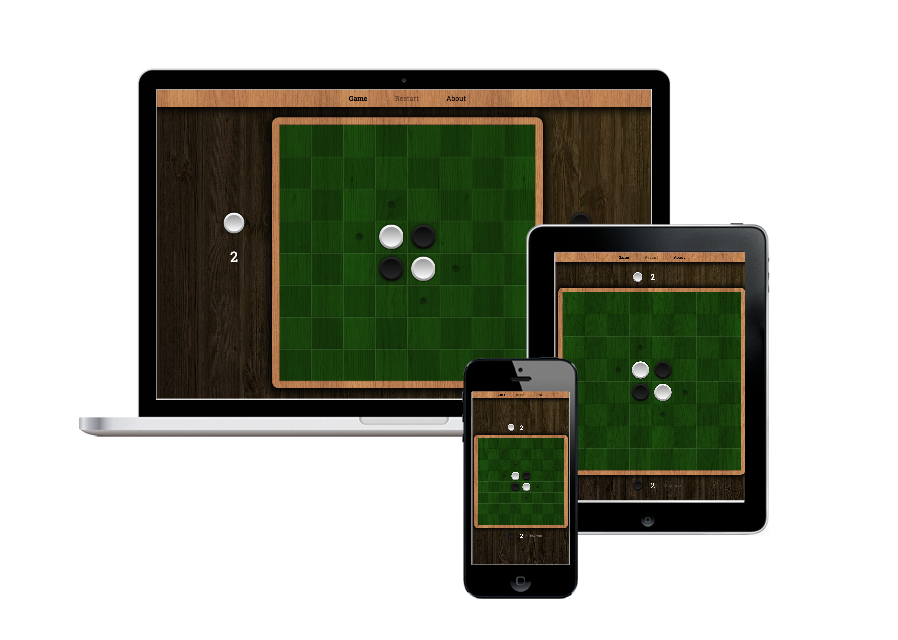

# Reversi

> [Reversi] board game implemented with [Vue.js 2] and [Vuex] (using [Vue CLI 3]).

[](https://reversi.amercier.com/)

[](https://travis-ci.org/amercier/reversi-vue)
[](https://codecov.io/github/amercier/reversi-vue?branch=master)
[](https://reversi.amercier.com/)
[](https://github.com/amercier/reversi-vue/issues?q=label%3Agreenkeeper)
[](https://david-dm.org/amercier/reversi-vue)
[](https://david-dm.org/amercier/reversi-vue#info=devDependencies)

## Getting started

### 1. Install dependencies

> **Prerequisites:** you need to have, [NodeJS] and [npm] installed.

```bash
yarn
```

Installs this project dependencies in the `node_modules/` directory.

### 2. Start a development server

```bash
yarn serve
```

Spawns a development server on <http://localhost:8080/>. See [Contributing Guide](CONTRIBUTING.md) for more details.

## Continuous Integration

Each commit is automatically tested on [Travis CI], which runs:

- **Linting** using [ESLint] and [Prettier],
- **Unit tests** using [Jest] with code coverage reported to [Codecov],
- **End-to-end tests** using [Cypress].

Pull Request previews are provided by [Netlify].

## Continuous Delivery

Each successful build on the `master` branch is automatically deployed by Travis CI on
`deploy` branch first. Then, [Netlify] automatically deploys the new code from `deploy`.

> **Note:** `GITHUB_TOKEN` environment variable must be set in Travis CI project.

### Custom deployment

[](https://app.netlify.com/start/deploy?repository=https://github.com/amercier/reversi-vue&command=yarn%20build&dir=dist)

## License

[](LICENSE.md)

## Credits

- Seamless wood textures by [SiberiaCrab] and [PNG Tree].
- [reversi](https://www.npmjs.com/package/reversi) by [Koujirou Ishii].

Thank you so much for your hard work!

[reversi]: https://en.wikipedia.org/wiki/Reversi
[vue.js 2]: https://vuejs.org/
[vue cli 3]: https://cli.vuejs.org/
[vuex]: https://vuex.vuejs.org/
[nodejs]: https://nodejs.org/
[npm]: https://www.npmjs.com/
[jest]: http://jestjs.io/
[codecov]: https://codecov.io
[cypress]: https://www.cypress.io/
[netlify]: https://app.netlify.com/
[eslint]: https://eslint.org/
[prettier]: https://prettier.io/
[travis ci]: https://travis-ci.org
[siberiacrab]: https://www.deviantart.com/siberiancrab
[png tree]: https://fr.pngtree.com/
[koujirou ishii]: http://kjirou.net/
